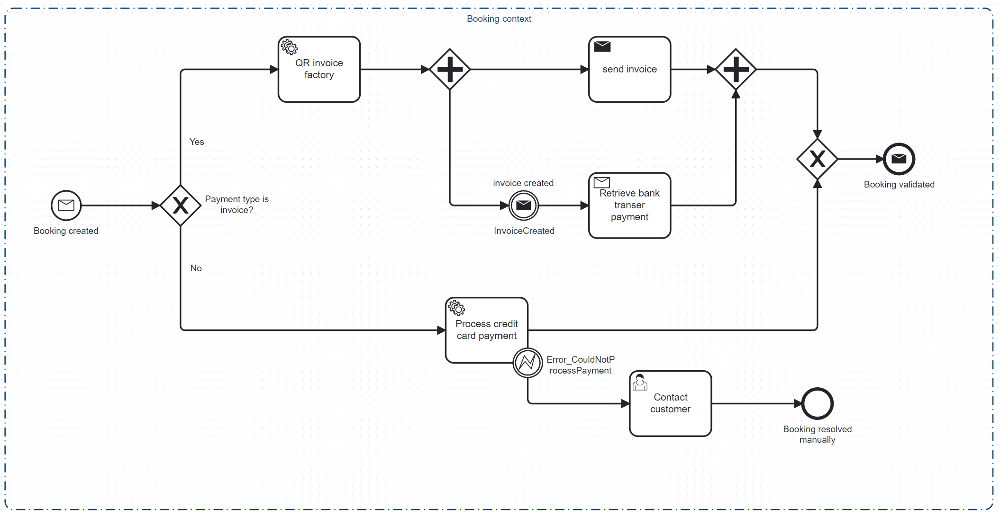

# Fusion Flow
This project simulates a typical business logic workflow using event-driven architecture. The implementation is based on
the implementation of [flowing retail](https://github.com/scs-edpo/lab04-flowing-retail).
We use Apache Kafka and Camunda Process orchestration to facilitate our workflow. 


## General description
This project simulates the possible process of a customer booking an event at the Fusion Arena St. Gallen. Thereby, focus is on customers that pay via invoice. Since there is a need for a bank payment without live payment processing, the process has to make sure and check that the payment has been received before the booking is confirmed. The customer is given a time of 30 days to make the payment.


## Explicit references to the concepts of the lecture
Apache Kafka is used as an open-source distributed event streaming platform. All four implemented services, [accounting](kafka/java/accounting), [booking](kafka/java/booking), [notification](kafka/java/notification) and [qrInvoice](kafka/java/qrInvoice) are connected via Kafka topics. Have a look at the messages folder for the corresponding kafka topics of each service. Kafka is used for the communication between the services and the orchestration of the processes.

An event notification is for example created when a new booking is made. One Kafka topic was used called "flowing-retail" where events are distinguished among each other by name and service type. The advantage are decoupling, dependency inversion and that changes in one service do not affect the other services. The biggest disadvantage is that no statement of overall behaviour can be made.

No event-carried state transfer is used in this project. There was no need to update a local copy of data in the services via events.

Camunda is used for the orchestration of the processes. The main process is the booking process, which is started when a new booking is made. The sub process is the accounting process, which is started when the booking process is waiting for the bank payment. The processes are orchestrated using the Camunda BPM platform for process & workflow orchestration. See in ADR section for explicit differentiation between orchestration and choreography.

We explicitly (see ADR) decided not to use Zeebe, the new process engine of Camunda 8, since we are using Camunda 7.

In lecture 6, [Sagas](https://www.youtube.com/watch?v=0UTOLRTwOX0) and "Stateful Resilience Patterns" were introduced. We use the "Epic Saga" (traditional saga pattern) in our project. The Saga pattern is a way to manage transactions that span multiple services. A saga is a sequence of local transactions. Each local transaction updates the database and publishes a message or event to trigger the next local transaction in the saga. If a local transaction fails because it violates a business rule then the saga executes a series of compensating transactions that undo the changes that were made by the preceding local transactions. The saga pattern is used in the booking process. If the customer decides to pay by card, the booking is directly confirmed. If the customer decides to pay by invoice, the booking is confirmed after the bank payment has been received. If the bank payment is not received within 30 days, the booking is cancelled. The saga pattern is used to manage the transactions of the booking process.

As resilience pattern, human intervention is used. In the accounting process, we best saw fit that, after an automatic rejection of a customer, our accounts have the final word on rejecting or approving a customer. Our software calls an external relational database to see any customer that was put on the blacklist, if we find that a customer has been rejected in the past, we will mark him for human review. To not lose out on a possible sale due to the automatic rejection, this manual review step serves as a fallback, we provide the customer name and his booking to a human agent, who has last call on wether to reject a booking or if we take the chance and allow a booking. Even if we allow a rejected booking manually, the booking gets automatically cancelled if we do not receive the payment within 30 days. 


## ADR (Architecture Decision Records)
Please find all ADRs in the [docs/adr](docs/adr) folder.
- Choosing between Camunda 7 and 8
- Distinction between Orchestration and Choreography


## Building the project
Use the Maven task "flowing-retail-kafka" to clean and rebuild all projects in the application. To run the Flowing Retail project you first need to be sure that all the relevant projects have been built at least once: (Maven Window -> Run Maven Build "green play button" )

```
  $ cd .\kafka\java\
  $ mvn clean install
```

Then you can execute:

```
  $ docker-compose -f docker-compose.yml up --build
```

(omit --build if you have already built the images):

```
  $ docker-compose -f docker-compose.yml up
```
from the directory [runner/docker-compose](runner/docker-compose).

### Launching the application
There is a [docker-compose](runner/docker-compose/docker-compose.yml) script that, when executed, launches all relevant project in docker.

### Accessing the Camunda cockpit
To have an overview of the processes and the running instances, you have to access the Camunda Cockpits. It is suggested to use a private window (Incognito mode) to avoid any caching issues.

- [Main process](http://localhost:8091/)
- [Sub process](http://localhost:8097/)

Use the following credentials to log in:

- Username: flowingRetail
- Password: flowingRetail

Or find them here for [main](kafka/java/booking/src/main/resources/application.yaml) and [sub](kafka/java/accounting/src/main/resources/application.yaml) process.

### Start a new process
To start a new process, access [this link.](http://localhost:8091/booking.html) Once you enter a date for your booking and press "book", you should be able to see that a new main process instance has started. 

The sub process should be waiting for receiving the bank payment, as can be seen here:


## Our process
So far, we use Kafka as a message broker, passing messages between bounded contexts and processes.
The main (=booking) process, as well as the sub (=accounting) process, is orchestrated using a Camunda process definition. 

Booking Process:


Accounting Process:


The booking process waits for the Bank Payment Retrieved message, originating from the Accounting process, after it notifies the accounting process, that a new booking has been made. We skip the entire process, if the customer decided to pay by card, since then we already have collected the money and the booking is valid.
The accounting process first passes the customer through an automatic booking review, where we access an external database to see if we have rejected this customer in the past. if this is the case, we flag the customer for a human review, where an accountant can take any necessary steps to deem a booking valid or invalid.
If the booking is deemed valid, either automatically through our system or by a human accountant, we set the process on hold and wait for the money to arrive. Our software waits for the arrival of a Kafka message from our bank, confirming that we received the money from the customer. Camunda automatically continues the process to cancel the order,
if we do not receive any money within 30 days.

## Implementation Details and Related Architectural Decisions
### Main Process: Booking
To be able to start up a new process, we created a simple HTML interface that is served via the spring framework. The Template takes a date and
a boolean, indicating whether the customer wants to pay by card or invoice. This form sends out a request to a REST API endpoint, also provided with Spring, controlled by our [ShopRestController](kafka/java/booking/src/main/java/io/flowing/retail/booking/rest/ShopRestController.java) class.
This endpoint builds the start message "booking created" that triggers our main Camunda Process. Camunda automatically checks for the payment type via direct expression, to choose the orchestration path.
The QR invoice factory task is implemented by the [QrInvoiceAdapter](kafka/java/booking/src/main/java/io/flowing/retail/booking/flow/QrInvoiceAdapter.java) class.
This delegate sends out a REST GET request to our [qrInvoice microservice](kafka/java/qrInvoice/src/main/java/qrInvoice/rest/QrFactoryRestController.java). 
The microservice simply takes the amount that was handed to it via the API and creates a Base64 encoded string to return to the caller. We decided for a direct dependency, via REST call since the rest of the process depends on the availability of the QR invoice,
we want to continue the process without being blocked by excessive waiting for an asynchronous answer. This creates stronger coupling and requires the QR service to be more resilient to outages,
but because sending out an invoice is a central task in a checkout process, and we have enough waiting time in the following subprocess, we don't want to possibly block the process so early on.
With the QR now created, we add this to the Camunda process message as a variable and continue on down the process to the parallel executed branches.
Sending the invoice to the customer is simple, we chose to utilize an event instead of a command, as it is not all that time sensitive when the customer receives the bill.
The [SendInvoiceAdapter](kafka/java/booking/src/main/java/io/flowing/retail/booking/flow/SendInvoiceAdapter.java) delegate sends out a Kafka message containing the QR bill string to any interested services (in this case, the [notification service](kafka/java/notification/src/main/java/io/flowing/retail/notification/messages/MessageListener.java), which catches the event and sends out the bill).
Once again we opted for an event based trigger instead of a command, as this execution branch runs in parallel to another branch, which can take up to 30 days to complete, thus actually sending out the invoice is neither blocking the rest of the process, nor is it time sensitive compared to the 30-day time limit posed by the subprocess called in the paralel branch.

While the invoice gets sent out to the customer, the [InvoiceCreatedAdapter](kafka/java/booking/src/main/java/io/flowing/retail/booking/flow/InvoiceCreatedAdapter.java) delegate sends out a similar, but distinct, event via Kafka, which triggers the accounting subprocess. A event is sufficient in this case, since paying a bill can take up to 30 days anyway, so time is not of the essence.
This branch now waits for a Camunda message “BankTransferRetrievedNew”, which will be triggered via Kafka event "PaymentHandled" by the accounting process, once that has dealt with the new booking. The Kafka event that triggers the message is caught in the bookings [MessageListener](kafka/java/booking/src/main/java/io/flowing/retail/booking/messages/MessageListener.java). The "BankTransferRetrievedNew" Camunda message signifies the end of the booking process.

### Sub Process: Accounting
Our Accounting Microservice is subscribed to the kafka message sent out by the main process, we listen for it in the services [MessageListener](kafka/java/accounting/src/main/java/io/flowing/retail/accounting/messages/MessageListener.java).
Once the Camunda process is kicked off by this message, the software checks the creditworthiness of the customer by calling an external Database, containing a blacklist of customers that are not trustworthy. This is done in [ApproveCustomerAdapter](kafka/java/accounting/src/main/java/io/flowing/retail/accounting/flow/ApproveCustomerAdapter.java) delegate. An external MySQL database is queried to see if the customer has been blacklisted in the past. At the moment, there are 3 customers blacklisted. When an new booking is made, the customer is checked against the blacklist. A new field, email, is added to the [booking form](http://localhost:8091/booking.html). If the customer is not blacklisted, the process continues with the "accepted" execution path.

If the customer is approved, the process moves on to a passive state of waiting for a notification by the bank, that we received the money. The bank can reach us via a REST call, the controller for which is implemented in [AccountingRestController](kafka/java/accounting/src/main/java/io/flowing/retail/accounting/rest/AccountingRestController.java).
Our [PaymentReceivedAdapter](kafka/java/accounting/src/main/java/io/flowing/retail/accounting/flow/PaymentReceivedAdapter.java) class is the delegate tasked with handling this banking notification, here one could insert any business logic needed to bring our accounts into a correct state (e.g. mark the invoice as paid). This is another possibly boundary crossing Camunda throw message event, in case we need to inform further microservices about the successful payment.
Once that delegate is executed, our process moves on to the [PaymentHandledAdapter](kafka/java/accounting/src/main/java/io/flowing/retail/accounting/flow/PaymentHandledAdapter.java), where we create the PaymentHandled Kafka event, notifying our main process that this process instance has completed.

In case the customer was found to be on our Blacklist, our stateful resistance pattern kicks in. We don't want to lose out on any possible sales, thus we give a human accountant the chance to review the customers case, before making a final decision on whether to cancel the booking or to allow it. This is implemented as a Camunda user task. The accountant can log into Camunda, check the running processes, claim any flagged bookings and review their case. In the topright corner of the camunda interface, the user can select the Tasklist in order to find all the open user tasks and make the final decision on the validity of the booking.
If the accountant decides to allow the booking, we return to the "accepted" execution path, where we wait for payment, as described above.
If the booking has, once again, be deemed untrustworthy, or if we do not receive any notice by our bank that the payment has been made within 30 days of the booking, we begin cutting out losses and cancel the booking.
This happens in the [CancelOrderAdapter](kafka/java/accounting/src/main/java/io/flowing/retail/accounting/flow/CancelOrderAdapter.java) (here we can include any accounting business logic needed to bring us to a consistent state),
and in the [InvoiceVoidedAdapter](kafka/java/accounting/src/main/java/io/flowing/retail/accounting/flow/InvoiceVoidedAdapter.java) (this is meant for any domain boundary crossing logic, here we would call the notification service to send an email informing the customer that their booking has been voided, and create a Kafka message that could be read by any interested Microservice),
respectively. Finally, as the accounting department is in a consistent state and all relevant interested services have been notified, of the booking state, we finish the process by notifying the main booking process, again through the [PaymentHandledAdapter](kafka/java/accounting/src/main/java/io/flowing/retail/accounting/flow/PaymentHandledAdapter.java) delegate.

## Collaboration
All team members contributed equally to the group project.
- [Luzi Schöb](https://github.com/taschoebli)
- [David Seger](https://github.com/DavidSeger)
- [Christoph Zweifel](https://github.com/c2fel)

## Reflections & lessons learned
- We learned how to use Apache Kafka as a message broker and how to connect services via Kafka topics.
- We learned how to use Camunda for process orchestration.
- We learned the best practices of modelling processes in Camunda. 
- We learned how to use Docker to containerize our services.
- We learned how to use Maven & Spring to build our projects.
- We all did not have any experience with Kafka  & Camunda. We would have profited more from the guest lecture from the Camunda team (Niall Deehan) if we had more experience with the tool. It would have been great if Camunda 8 was introduced in the lecture, since it is the recommended version for new projects. We regret having started with Camunda 7.
- Group projects with small group size (not more than 3 people) are more efficient and effective. We had a good communication and could easily coordinate our tasks.
