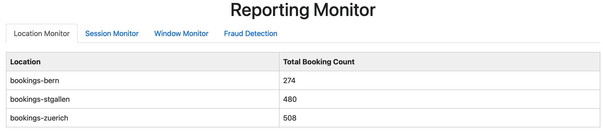
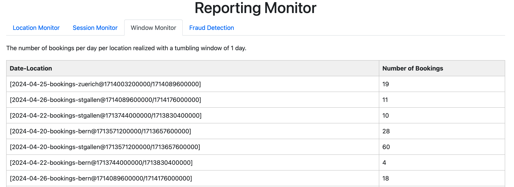

# Fusion Flow Assignment # 2
This project simulates a typical business logic workflow using event-driven architecture with kafka streams and stream processing. We use Apache Kafka to facilitate our workflow. 


## General Description
The application is mainly composed of two significant projects: the BookingProducer and the Reporting microservices.
The BookingProducer simulates a continuous stream of bookings and real-time session information. It writes data to the "bookings" topic, using the BookingEntry schema based on real booking data from Fusion Arena.
The BookingRepository class connects to the Fusion Arena database using JDBC (see below), simulating a steady stream of bookings. We detect fraudulent bookings through a probability method that creates 10% fraudulent entries. We use the Joda library for datetime handling.
The SessionInfoProducer generates another input stream, creating artificial SessionInfo entries from booking event times and sending them to the "sessionInfos" topic. This helps simulate session start times, with 40% of sessions starting late by 10 to 30 minutes.
The Reporting microservice handles the actual stream processing. It initializes and manages our four main topologies, handling serialization, custom partitioning, and providing interfaces for interactive queries. These queries can be accessed via a Javalin webpage. The webserver for these queries is implemented in the ReportingService.
This project demonstrates our approach to handling real-time data streams, the challenges we faced, and the solutions we implemented for efficient processing and reporting.


## Architecture and ARDs
We started off using Avro as a serialization scheme, traces of that can still be found in the topology [FilterProcessesToLocationsTopology](kafka/java/reporting/src/main/java/io/flowing/retail/reporting/topology/FilterProcessesToLocationsTopology.java), 
where we used avro to write to an output topic which was meant to make it integrable into other applications. After trying Avro for a while, we decided to switch back to a simple JSON based serialization, because working with Avro was tedious and not worth it for a student project with a pressing timeline. We recorded this decision in the 
ADR [0004_SerializationMethodDecision](docs/adr/0004_SerializationMethodDecision.md). 

The main parts of our application can be found in the [BookingProducer](kafka/java/bookingProducer) and in the [Reporting](kafka/java/reporting) projects:

The BookingProducer microservice is responsible for simulating a constant stream of bookings and real-time session infos. The class [BookingProducer](kafka/java/bookingProducer/src/main/java/io/flowing/retail/bookingProducer/BookingProducer.java) is responsible for creating and maintaining the Kafka producer writing to the topic "bookings".
Bookings are serialized using the [BookingEntry](kafka/java/bookingProducer/src/main/java/io/flowing/retail/bookingProducer/model/BookingEntry.java) schema. The data stems from real bookings of the "Fusion Arena" company, who allowed us to use their booking history database for this project. The most important fields in the schema for our topologies are:

- bookingId: The primary key for the stream.
- locationId: Indicates in which branch of the fusion arena the booking takes place.
- bookingDateTime: The time at which the booking was placed. This is relevant for our fraudulent booking monitor and the window monitor, showing on which days of the year the company gets most bookings.
- eventDateTime: The time for which the session is booked. This is relevant for our actual session info monitor.

The BookingProducer uses our [BookingRepository](kafka/java/bookingProducer/src/main/java/io/flowing/retail/bookingProducer/repository/BookingRepository.java) class. The BookingRepository class uses [jdbc](https://docs.oracle.com/javase/8/docs/technotes/guides/jdbc/) to connect to the database of Fusion Arena.
The class uses the connection to select all entries of the database and send it to the bookings topic over an extended period of time, simulating a constant stream of bookings coming in. For our fraudulent booking monitor, we use a probability method that creates "fraudulent" bookings in 10 percent of the entries. We define fraudulent bookings as a rapid succession of bookings by the same customer, indicating somebody is trying ot overwhelm our 
system by overloading it. To simulate this we resend the fraudulent booking entries multiple times, with a timestamp indicating that the booking took place mere seconds from each other. To deal with the datetime format of Fusion Arena (here, in the topologies and in the SessionInfoProducer), we use the Java library [Joda](https://www.joda.org/joda-time/), and a datetime format string defined in [Constants](kafka/java/bookingProducer/src/main/java/io/flowing/retail/bookingProducer/helpers/Constants.java). This allows us to easily manipulate dateTimes and convert them back to strings.

Our second input stream comes from the [SessionInfoProducer](kafka/java/bookingProducer/src/main/java/io/flowing/retail/bookingProducer/SessionInfoProducer.java), this class once again uses the BookingRepository class to access the real Fusion Arena database. It selects all bookings, and uses their eventTime field to construct an artificial [SessionInfo](kafka/java/bookingProducer/src/main/java/io/flowing/retail/bookingProducer/model/SessionInfo.java) entry. The SessionInfo has the relevant field "actualStartTime", which represents when the customers actually showed up for their appointment. We use this in our session stats monitor.
The producer sends the events to the Kafka topic "sessionInfos", we set up the simulation in such a way that we get a session info event every 30 seconds, 40 percent of all bookings are simulated to start too late by between 10 and 30 minutes. We once again use Joda for that.

The actual stream processing takes place in our [Reporting](kafka/java/reporting) microservice. The service sets up and starts our four topologies, which are described in detail in [the reporting README](kafka/java/reporting/README_Reporting.md). Besides serialization classes, a custom partitioner used in branching, and a few helpers and constants, the microservice is responsible for providing interfaces for our interactive queries, which are described below. The interactive queries can be accessed through a [Javalin](https://javalin.io/) webpage here: [http://localhost:7070](http://localhost:7070).
The webserver providing data by interactively querying our materialized kTables resulting from our topologies is implemented in our [ReportingService](kafka/java/reporting/src/main/java/io/flowing/retail/reporting/application/ReportingService.java).


## Topics Covered from the Lecture
### Stateless Operations
The following stateless operations that we got to know in the lectures have been implemented in the [FilterProcessesToLocationsTopology](kafka/java/reporting/src/main/java/io/flowing/retail/reporting/topology/FilterProcessesToLocationsTopology.java) class:

- **Filtering**: We filter out the unused "timestamp" field (see JSON below), as this represents the time at which the booking has been entered on the real life SQL Server of the company
- **Translation**: We translate the Customers name from cleartext to a hashed value, to protect customers identities. 
- **Branching & Re-Keying**: We branch the data stream by their locationId, after which we use a re-key operation to assign the branches keys describing their booking location (Bern, St. Gallen or Zürich). We also use our custom [LocationPartitioner](kafka/java/reporting/src/main/java/io/flowing/retail/reporting/partitioner/LocationPartitioner.java) to make sure that every event from a corresponding location gets put into the same Kafka partition.


JSON Object for better understanding of the data received in a kafka stream:
```json
{
  "locationId": 11,
  "bookingKey": "105957",
  "productName": "Auf der Suche nach Gulliver",
  "customerName": "John Doe",
  "bookingDateTime": "2024-05-09 14:30:21",
  "eventDateTime": "2024-05-15 18:00:00",
  "amount": 150,
  "paymentStatusIsPaid": true,
  "timestamp": "2024-05-09 14:30:25"
  }
```

These same stateless operations can be found in the [CombineStreamsAndPrepareForReportingTopology](kafka/java/reporting/src/main/java/io/flowing/retail/reporting/topology/CombineStreamsAndPrepareForReportingTopology.java).

### Stateful Operations

We have implemented the following stateful operations covered in the lecture, they can be found in our [CombineStreamsAndPrepareForReportingTopology](kafka/java/reporting/src/main/java/io/flowing/retail/reporting/topology/CombineStreamsAndPrepareForReportingTopology.java):

- **Stream Join**: We join the two streams "bookings" (which is materialized as a kTable) and "sessionInfos" in our [CombineStreamsAndPrepareForReportingTopology](kafka/java/reporting/src/main/java/io/flowing/retail/reporting/topology/CombineStreamsAndPrepareForReportingTopology.java).
- **Grouping**: We use multiple group operations across the topologies, in both non-windowed topologies we group by locations, to gather facts for different locations. In our [FraudDetectionTopology](kafka/java/reporting/src/main/java/io/flowing/retail/reporting/topology/FraudDetectionTopology.java) we group by customers, so we can perform a count on the sliding window to detect fraudulent bookings. Furthermore, we use grouping to group our bookings based on location and event time combined, to find out the busiest days for the branches.
- **Aggregation**: The [CombineStreamsAndPrepareForReportingTopology](kafka/java/reporting/src/main/java/io/flowing/retail/reporting/topology/CombineStreamsAndPrepareForReportingTopology.java) uses aggregations to gather statistics about session infos and bookings.

### Interactive Queries
In order to fulfill the requirement "Interactive queries" from exercise 9, several topologies have been introduced. The can all be queried from the [ReportingService](kafka/java/reporting/src/main/java/io/flowing/retail/reporting/application/ReportingService.java) by applying the following methods:


- [FilterProcessesToLocations](kafka/java/reporting/src/main/java/io/flowing/retail/reporting/topology/FilterProcessesToLocationsTopology.java) The idea is to get the bookings and filter them by location. The call is `/locationMonitor`: Returns the total amount of bookings per location.
The following image shows corresponding reporting monitor:



- [CombineStreamsAndPrepareForReporting](kafka/java/reporting/src/main/java/io/flowing/retail/reporting/topology/CombineStreamsAndPrepareForReportingTopology.java) The idea is to get statistics from a certain location by combining two streams. The call is `/sessionMonitor`: Returns averageSessionDelay, percentageOfCustomersTooLate, numberOfLateCustomers, totalLostTime and numberOfSessions per location.
The following image shows corresponding reporting monitor:
  


- [Window](kafka/java/reporting/src/main/java/io/flowing/retail/reporting/topology/WindowTopology.java) The idea is to get the number of bookings per day per location. The call is `/windowMonitor`: Returns number of bookings per day per location.
  The following image shows corresponding reporting monitor:
  


- [FraudDetection](kafka/java/reporting/src/main/java/io/flowing/retail/reporting/topology/FraudDetectionTopology.java) The idea is to measure fraudulent behaviour. In case a booking within a minute is made by the same person, an entry will be made here. This feature is used to detect an misuse of for example a stolen credit card.  The call is `/fraudDetection`: Returns count and customer Name of a fraudulent booking.
  


The reporting monitor is accessible through the Javalin web server with the following address:
http://localhost:7070

### Windowed Operations
Two windowed operations have been implemented. The first one is a tumbling window in order to get the events per day per location. The code of the figure depicted below can be found here: [WindowToplogy](kafka/java/reporting/src/main/java/io/flowing/retail/reporting/topology/WindowTopology.java)


The second windowed operation is a sliding window, here we extract the bookingDateTime to find out when a customer made the booking, and aggregate-count it based on a group-by customer name. We materialize this aggregate-count as a kTable, which is queried by an interactive query, only returning customers that made more than 1 booking within 1 minute, which we deem fraudulent and/or a DDoS attack. The topology implementation can be found here: [FraudDetectionTopology](kafka/java/reporting/src/main/java/io/flowing/retail/reporting/topology/FraudDetectionTopology.java), while the interactive queries can be found here: [ReportingService](kafka/java/reporting/src/main/java/io/flowing/retail/reporting/application/ReportingService.java). Below you can see the sliding window topology.


## Building the project
To run the Flowing Retail reporting project, you first need to be sure that all the relevant projects, namely [bookingProducer](kafka/java/bookingProducer) and [reporting](kafka/java/reporting) have been built at least once: (Maven Window -> Run Maven Build "green play button" )

```
  cd .\kafka\java\
  mvn clean install
```

Then you can execute:

```
  docker-compose -f docker-compose-stream-only.yml up --build
```

(omit --build if you have already built the images):

```
  docker-compose -f docker-compose-stream-only.yml up
```
from the directory [runner/docker-compose](runner/docker-compose).

### Launching the application
1. There is a [docker-compose](runner/docker-compose/docker-compose-stream-only.yml) script that, when executed, launches the kafka environment that is needed for this project. Wait a few minutes...
2. Run the [BookingProducer](kafka/java/bookingProducer/src/main/java/io/flowing/retail/bookingProducer/BookingProducer.java) project to produce booking events to the kafka topic.
3. Run the [SessionInfoProducer](kafka/java/bookingProducer/src/main/java/io/flowing/retail/bookingProducer/SessionInfoProducer.java) project to produce further events to the kafka topic.
4. Run the [ReportingApplication](kafka/java/reporting/src/main/java/io/flowing/retail/reporting/ReportingApplication.java) project to start the reporting service. Please refer to this [README_Reporting](kafka/java/reporting/README_Reporting.md) for all the information in detail. Next, you can access the service here: http://localhost:7070.

These are all the important steps. Have fun!

## Collaboration
All team members contributed equally to the group project.
- [Luzi Schöb](https://github.com/taschoebli)
- [David Seger](https://github.com/DavidSeger)
- [Christoph Zweifel](https://github.com/c2fel)

## Reflections & lessons learned
- All the mentioned topics in [Assignment1](README_Assignment1.md)
- Thanks to the lecture slides and the great reference, Mastering Kafka Streams and ksqlDB, we learned all about stateless and stateful processing. We could familiarize ourselves with windows and time operations. 
- We feel more comfortable about event-driven systems overall.
- Complexity of debugging has increased
- Time management was improved compared to assignment1 (there was much less time)
- The book recommended in the lecture slides, does an excellent job to gain necessary theoretical knowledge and helps with the implementation as well
