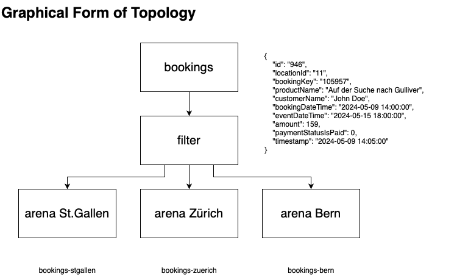
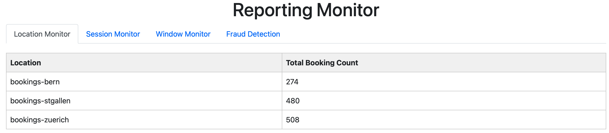

# Reporting

## Stateless Operations
The following stateless operations have been implemented in the [FilterProcessesToLocationsTopology](../../../kafka/java/reporting/src/main/java/io/flowing/retail/reporting/topology/FilterProcessesToLocationsTopology.java) class:
- **Filtering**: Filter the "bookings" stream by location and create three branches based on the location id. 


JSON Object for better understanding of the data received in a kafka stream:
```json
{
  "locationId": 11,
  "bookingKey": "105957",
  "productName": "Auf der Suche nach Gulliver",
  "customerName": "John Doe",
  "bookingDateTime": "2024-05-09 14:30:21",
  "eventDateTime": "2024-05-15 18:00:00",
  "amount": 150,
  "paymentStatusIsPaid": true,
  "timestamp": "2024-05-09 14:30:25"
  }
```


## Interactive Queries
In order to fulfill the requirement "Interactive queries" from exercise 9 [ReportingService](../../../kafka/java/reporting/src/main/java/io/flowing/retail/reporting/topology/ReportingService.java) has been introduced. This service is responsible for exposing the interactive queries to the outside world. The interactive queries are the following:
- `/locationMonitor`: Return the total amount of bookings per location.

The reporting monitor is accessible through the Javalin web server with the following address:
http://localhost:7070

The following image shows the reporting monitor:


