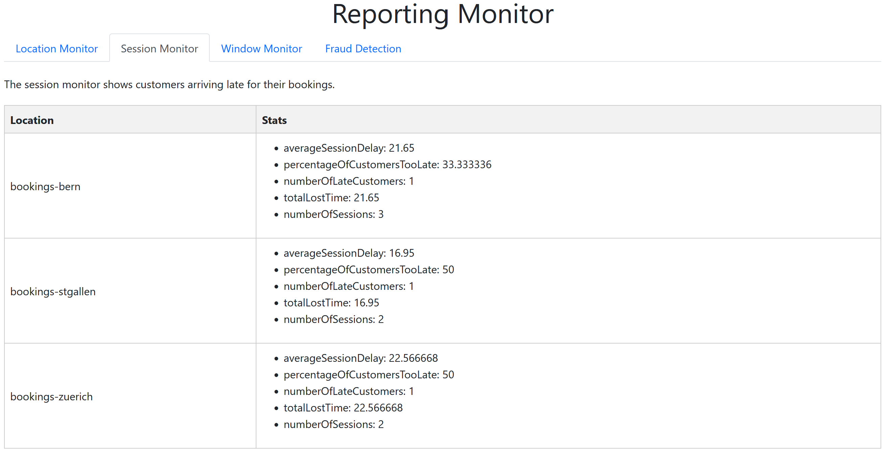

# Reporting

## General Description
  //ToDo: Describe our application, its streams, the output, architecture and the business logic

## Architecture and ARDs
 // ToDo: describe

## Topics Covered from the Lecture
### Stateless Operations
The following stateless operations that we got to know in the lectures have been implemented in the [FilterProcessesToLocationsTopology](../../../kafka/java/reporting/src/main/java/io/flowing/retail/reporting/topology/FilterProcessesToLocationsTopology.java) class:

- **Filtering**: We filter out the unused "timestamp" field (see JSON below), as this represents the time at which the booking has been entered on the real life SQL Server of the company
- **Translation**: We translate the Customers name from cleartext to a hashed value, to protect customers identities. 
- **Branching & Re-Keying**: We branch the data stream by their locationId, after which we use a re-key operation to assign the branches keys describing their booking location (Bern, St. Gallen or Zürich).


JSON Object for better understanding of the data received in a kafka stream:
```json
{
  "locationId": 11,
  "bookingKey": "105957",
  "productName": "Auf der Suche nach Gulliver",
  "customerName": "John Doe",
  "bookingDateTime": "2024-05-09 14:30:21",
  "eventDateTime": "2024-05-15 18:00:00",
  "amount": 150,
  "paymentStatusIsPaid": true,
  "timestamp": "2024-05-09 14:30:25"
  }
```

These same stateless operations can be found in the [CombineStreamsAndPrepareForReportingTopology](src/main/java/io/flowing/retail/reporting/topology/CombineStreamsAndPrepareForReportingTopology.java).

### Stateful Operations

We have implemented the following stateful operations covered in the lecture, they can be found in our [CombineStreamsAndPrepareForReportingTopology](src/main/java/io/flowing/retail/reporting/topology/CombineStreamsAndPrepareForReportingTopology.java):

- **Stream Join**: We join the two streams "bookings" (which is materialized as a kTable) and "sessionInfos"

### Interactive Queries
In order to fulfill the requirement "Interactive queries" from exercise 9, several topologies have been introduced. The can all be queried from the [ReportingService](../../../kafka/java/reporting/src/main/java/io/flowing/retail/reporting/application/ReportingService.java) by applying the following methods:


- [FilterProcessesToLocations](../../../kafka/java/reporting/src/main/java/io/flowing/retail/reporting/topology/FilterProcessesToLocationsTopology.java) The idea is to get the bookings and filter them by location. The call is `/locationMonitor`: Returns the total amount of bookings per location.
The following image shows corresponding reporting monitor:


- [CombineStreamsAndPrepareForReporting](../../../kafka/java/reporting/src/main/java/io/flowing/retail/reporting/topology/CombineStreamsAndPrepareForReportingTopology.java) The idea is to get statistics from a certain location by combining two streams. The call is `/sessionMonitor`: Returns averageSessionDelay, percentageOfCustomersTooLate, numberOfLateCustomers, totalLostTime and numberOfSessions per location.
The following image shows corresponding reporting monitor:
  


- [Window](../../../kafka/java/reporting/src/main/java/io/flowing/retail/reporting/topology/WindowTopology.java) The idea is to get the number of bookings per day per location. The call is `/windowMonitor`: Returns number of bookings per day per location.
  The following image shows corresponding reporting monitor:
  


- [FraudDetection](../../../kafka/java/reporting/src/main/java/io/flowing/retail/reporting/topology/FraudDetectionTopology.java) The idea is to measure fraudulent behaviour. In case a booking within a minute is made by the same person, an entry will be made here. This feature is used to detect an misuse of for example a stolen credit card.  The call is `/fraudDetection`: Returns count and customer Name of a fraudulent booking.
  


The reporting monitor is accessible through the Javalin web server with the following address:
http://localhost:7070

### Windowed Operations
Two windowed operations have been implemented. The first one is a tumbling window in order to get the events per day per location. The code of the figure depicted below can be found here: [WindowToplogy](../../../kafka/java/reporting/src/main/java/io/flowing/retail/reporting/topology/WindowTopology.java)


The second windowed operation is a sliding window, here we extract the bookingDateTime to find out when a customer made the booking, and aggregate-count it based on a group-by customer name. We materialize this aggregate-count as a kTable, which is queried by an interactive query, only returning customers that made more than 1 booking within 1 minute, which we deem fraudulent and/or a DDoS attack. The topology implementation can be found here: [FraudDetectionTopology](src/main/java/io/flowing/retail/reporting/topology/FraudDetectionTopology.java), while the interactive queries can be found here: [ReportingService](src/main/java/io/flowing/retail/reporting/application/ReportingService.java). Below you can see the sliding window topology.


## Reflections & lessons learned

// TODO: Write this

