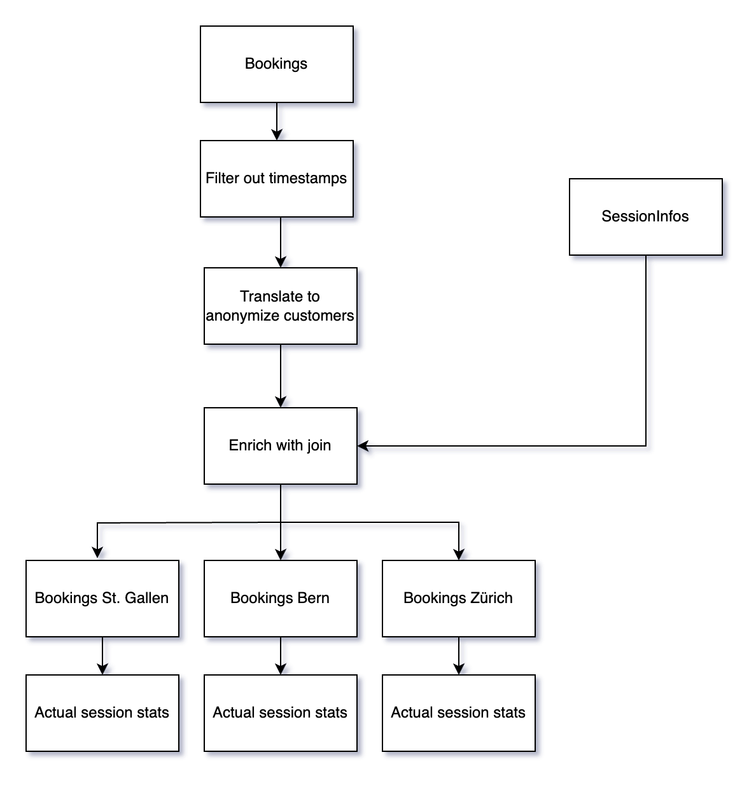

# Reporting

## Reporting Topologies

We implemented 4 topologies for reporting purposes:

- [FilterProcessesToLocationsTopology:](../../../kafka/java/reporting/src/main/java/io/flowing/retail/reporting/topology/FilterProcessesToLocationsTopology.java) This topology was meant to showcase a variety of stateless operations. It is subscribed to the bookings topic as a kStream. We first use a filter operation to remove the "timestamp" attribute, as it only represents the time when the entry was put into Fusion Arenas database. We then translate real customer names to a string hash, so we can anonymize the names. As a last step we branch and re-key the stream to use a string based on the locationId as the new keys for the three separate streams (bookings St. Gallen, bookings Bern and bookings Zürich). For our interactive queries we use an aggregate count, which displays us the amount of bookings per company branch

- [CombineStreamsAndPrepareForReportingTopology:](../../../kafka/java/reporting/src/main/java/io/flowing/retail/reporting/topology/CombineStreamsAndPrepareForReportingTopology.java) We showcase some stateful operations as well as combining multiple data streams. We use the same stateless operations as in the topology above, but we start the bookings stream off as a kTable, so we don't have to define a merge time window to combine the data. The topic is not only subscribed to the bookings topic, but also to the sessionInfos topic. We combine these two data sources into a new data schema, the [BookingEntrySessionInfo](../../../kafka/java/reporting/src/main/java/io/flowing/retail/reporting/Serialization/model/joins/BookingEntrySessionInfo.java). This schema is simply the union of all the fields of both data types. With the two streams combines, we once again group it to the locations and then use an aggregate to compile statistics about the bookings and the actual session times. These statistics can be found in the [SessionStats](../../../kafka/java/reporting/src/main/java/io/flowing/retail/reporting/Serialization/model/aggregations/SessionStats.java) model. 
We combine key figures like average session delay time, total operation time lost due to people coming too late and number of late customers. 
The statistics get queried by the Javalin webpage under the tab Session Monitor.

- [WindowTopology:](../../../kafka/java/reporting/src/main/java/io/flowing/retail/reporting/topology/WindowTopology.java)
This topology was implemented to aggregate all events occurring within a day at a specific location. From the bookings stream, the eventDateTime entry is extracted using a custom extractor class to ensure the correct format for windowed operations. The events are then grouped by locationId, followed by the application of a tumbling window of one day. Within this window, all entries are counted and summed up.

- [FraudDetectionTopology:](../../../kafka/java/reporting/src/main/java/io/flowing/retail/reporting/topology/FraudDetectionTopology.java) We start off with a stream from the bookings, we extract the bookingDateTime (e.g. the date time of when the booking was placed), this will be the basis for our windowing. We group the stream by customer and then apply a sliding window, that is one minute big. This allows us to count the amount of bookings done by one customer within one minute. Our interactive query on the Javalin application queries the results for every customer that has placed more than one booking within a minute, and flags it as a possibly fraudulent booking. 

